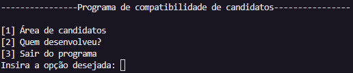
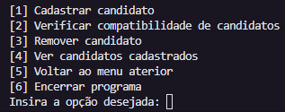
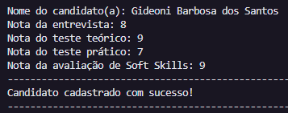
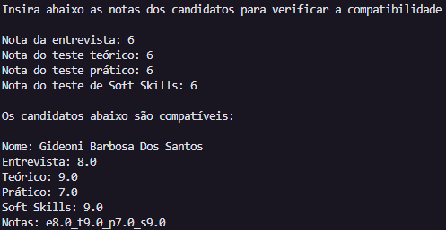
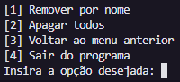
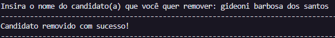
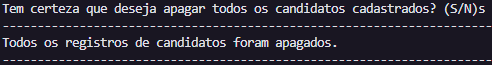
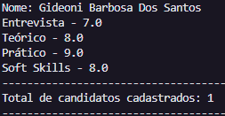

># Projeto individual - Modúlo 2 - Resilia

>### O que é?
O programa desenvolvido neste projeto tem como princípal objetivo a verificação de candidatos para uma vaga. Os critérios para determinar se o candidato está apto ou não, são as notas que ele recebeu em testes, são eles: **Entrevista**, **teste teórico**, **teste prático** e avaliação de **Soft Skills**. **Use os números referentes a cada opção para navegar entre os menus**
 
_Menu inicial_ / _Menu "Área de candidatos"_

>### Como funciona?
1. Com as notas já estabelecidas, vá para a área de "**Cadastrar candidatos**", nela é possível cadastrar os candidatos inserindo seu nome e as notas dos testes realizados respectivamente. **Use os números referentes a cada opção para navegar entre os menus**

_Insira o nome e as notas que os candidatos teve nos seus testes._
 

2. Com os candidatos inseridos volte para a opcão 2 "**Verificar compatibilidade de candidatos**", coloque as notas dos testes que você deseja fazer a verificação de compatibilidade. Com isso, apenas os candidatos que tiverem nota nos testes **igual ou superior** as que você definiu irão ser mostradas.

_Insere as notas para a verificação e retorna os candidatos compatíveis_
 

3. **Para remover candidatos** você pode ir até a opção **Remover candidato**.

_Escolha uma opção "Remover por nome" ou "Apagar todos"_
 

4. Se você escolheu remover por "**nome do candidato**", coloque o nome do candidato cadastrado. O programa irá verificar se o candidato inserido está cadastrado, então será informado uma mensagem confirmando que o usúario foi removido com sucesso. Caso contrário, retorna uma mensagem que nenhum candidato foi encontrado.

_Você também pode colocar o nome minúsculo que o programa irá procurar o candidato e remove-lo._
 

5. Se você escolheu "**Apagar Todos**", uma mensagem de confirmação irá aparecer pois **esta opção apaga todos os candidatos cadstrados**, confirme com "**S**" ou para cancelar a ação "**N**".

_Confirme se realmente você quer apagar todos os candidatos cadastrados._
 

6. Você também pode ver todos os candidatos cadastrados seguido da quantidade total de candidatos. Para isso vá para a opção 4 "**Ver candidatos cadastrados**".

_Mostra todos os candidatos cadastrados seguido de suas respectivas notas e a quantidade total de candidatos_
